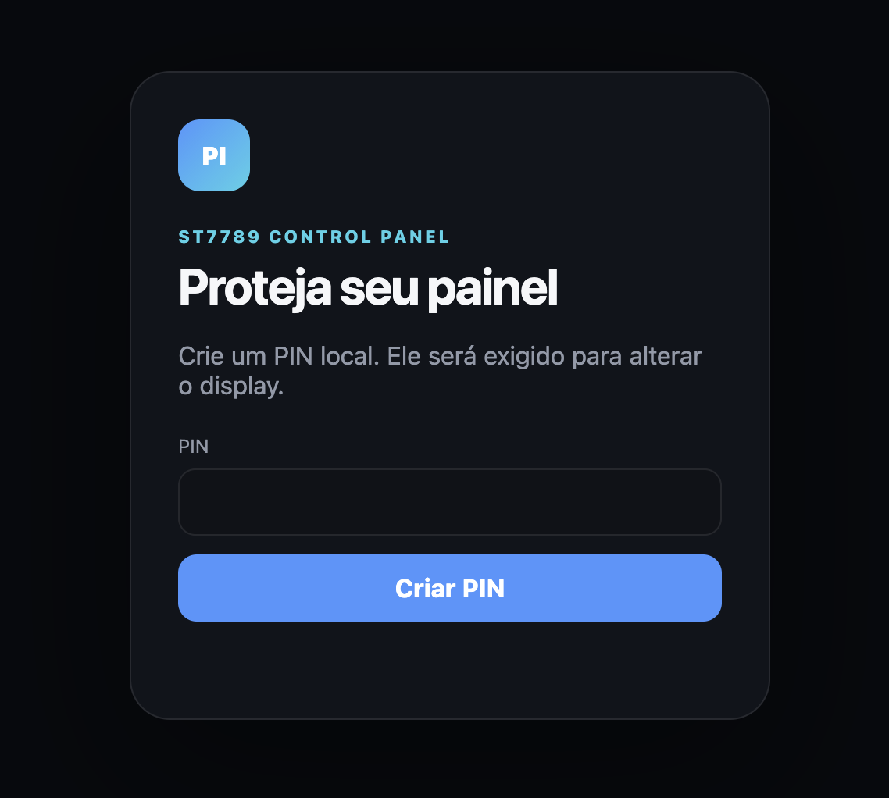
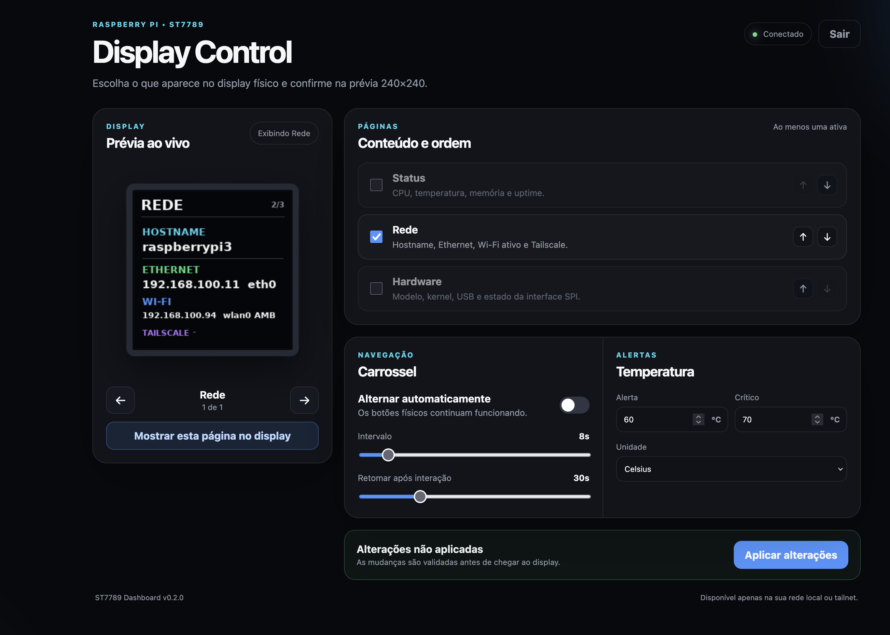
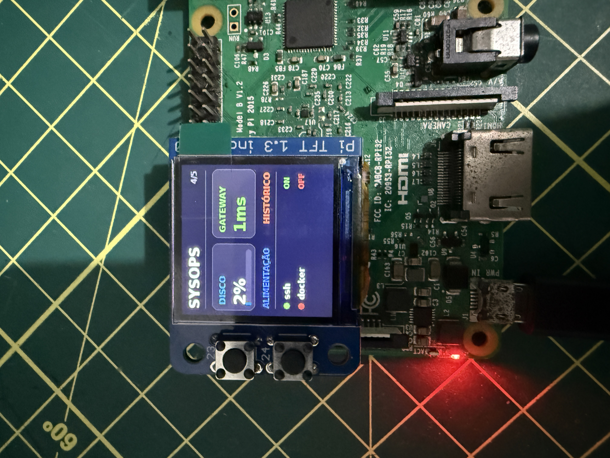
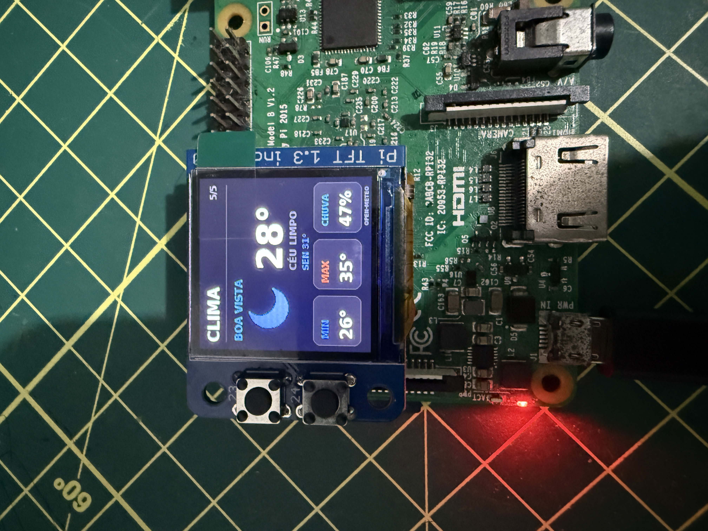

# Raspberry Pi ST7789 Dashboard

Dashboard compacto para Raspberry Pi com display TFT ST7789 1.3" 240×240 via SPI e navegação por dois botões físicos.


O projeto foi desenvolvido e validado em um **Raspberry Pi 3 Model B V1.2**, usando Raspberry Pi OS Lite 32-bit. A versão 0.8.0 acrescenta MQTT somente de leitura, sensores de texto/JSON e drivers opcionais experimentais SSD1306/ILI9341, com simulação segura no painel e layout OLED nativo. Mantém Docker local, seis modelos HTTP/JSON, Relógio/Pomodoro, Pi-hole 6/Home Assistant, credenciais privadas, backup, Clima e SysOps.

## Visão do produto

O projeto combina um **microdashboard modular, offline-first e controlado por dois botões** com um painel web local. O display continua funcional sem navegador e sem internet; a interface web apenas configura o conteúdo e o comportamento.

Pelo computador ou celular, o usuário pode:

- escolher quais páginas e recursos aparecem no display;
- alterar a ordem das páginas e o intervalo do carrossel;
- configurar limites de alerta e unidade de temperatura;
- configurar previsão do tempo por latitude e longitude;
- monitorar disco, gateway, alimentação e serviços `systemd` permitidos;
- acompanhar contêineres Docker locais, sem iniciar/reiniciar nada nem conceder permissões;
- exibir até quatro sensores MQTT, com tópicos exatos e credenciais privadas, sem publicar comandos;
- simular telas monocromáticas/retangulares sem trocar o display físico;
- criar páginas para APIs HTTP/JSON sem alterar o código;
- configurar Pi-hole 6 e até quatro entidades do Home Assistant com credenciais separadas dos ajustes;
- exportar e restaurar a configuração sem alterar PIN ou credenciais locais;
- configurar relógio com data, fuso e formato de 12/24 horas;
- iniciar, pausar, retomar e reiniciar um Pomodoro de 1–120 minutos pelo painel;
- visualizar uma prévia fiel de 240×240 gerada pelo mesmo renderizador Pillow usado no ST7789;
- aplicar mudanças sem editar o código-fonte ou reiniciar o serviço.

O MVP físico, o Web Control Panel e as páginas Clima e SysOps da versão 0.3.0 estão homologados no Raspberry Pi 3. A atualização preservou a configuração anterior e adicionou as integrações de forma opt-in, sem regressão nos botões, na prévia ou no carrossel.

A instalação ativa v0.6.0 foi confirmada no Raspberry em 17/09/2026, com SPI, serviços, API e estado do display aprovados. A v0.7.0 tem 118 testes aprovados no computador, no ARM em checkout separado e no CI, mais fluxo de navegador com serviços fictícios. Backup privado recente preparado, sem alterar PIN/configuração ou os serviços ativos. Isso não substitui homologação real de Docker/Pi-hole/Home Assistant ou leitura das novas páginas no ST7789. Os testes manuais foram adiados pelo mantenedor para o final; Docker entra desativado na migração e não instala/autoriza acesso ao daemon. O socket padrão não estava presente no Pi. Veja [monitor Docker e atualização](docs/DOCKER_MONITOR.md) e [modelos HTTP/JSON](docs/CUSTOM_TEMPLATES.md).

Na v0.8.0, 145 testes passaram no computador e no ARM em checkout separado, sem instalar ferramentas opcionais nesses hosts. No [CI](https://github.com/abraaobat/raspberrypi-st7789-dashboard/actions/runs/35229790027), todos os 148 passaram, incluindo três com Mosquitto real isolado e o fluxo completo do painel. A landing local/publicada passou nas oito combinações de idioma/tamanho. Backup privado e auditoria posterior confirmaram PIN/configuração e serviços ativos v0.6.0 preservados. MQTT usa consultas curtas: favorece valores retidos, não garante eventos transitórios nem infere hora da medição. Drivers extras ainda são experimentais, sem homologação em módulos reais. Atualização e testes físicos ficam para o [checklist final](docs/FINAL_VALIDATION.md); [evidências e preparação](docs/NEXT_SESSION.md).

### Modelos para seu próprio app

Em **Adicionar fonte**, escolha Métrica, Status, Temperatura, Energia, Node-RED ou Item de uma lista. Use **Usar modelo**, adapte os campos e confira os caminhos em um exemplo JSON sem consultar a API. Depois teste a URL real, guarde no rascunho e aplique. A lista de apps não é fixa: qualquer endpoint GET/JSON compatível pode alimentar uma das oito páginas personalizadas, respeitando os limites de segurança. [Guia completo](docs/CUSTOM_TEMPLATES.md).

- [Roadmap do produto](ROADMAP.md)
- [Especificação do Web Control Panel](docs/WEB_CONTROL_PANEL.md)
- [Integrações, clima e fontes personalizadas](docs/INTEGRATIONS.md)
- [Backup, credenciais e atualização](docs/BACKUP_AND_CREDENTIALS.md)
- [Relógio e Pomodoro offline](docs/DESK_MODE.md)
- [Docker local: contêineres e saúde](docs/DOCKER_MONITOR.md)
- [MQTT: sensores retidos e limites](docs/MQTT_MONITOR.md)
- [Compatibilidade: drivers opcionais e simulação](docs/DISPLAY_COMPATIBILITY.md)
- [Checklist final dos testes manuais adiados](docs/FINAL_VALIDATION.md)
- [Página pública do projeto](https://abraaobat.github.io/raspberrypi-st7789-dashboard/)

## Recursos

### Web Control Panel

- interface responsiva para desktop e celular;
- primeiro acesso protegido por PIN local;
- ativação e ordenação das páginas;
- carrossel automático e retomada após uso dos botões;
- limites de alerta de temperatura;
- prévia PNG 240×240 com dados atuais;
- seleção imediata da página exibida no hardware;
- formulário de clima, serviços locais e fontes personalizadas;
- teste de conexão antes de salvar uma fonte HTTP/JSON;
- configuração JSON validada e gravada de forma atômica.





### Página pública e apoio ao projeto

O repositório inclui uma landing page bilíngue em `site/`, publicada automaticamente pelo GitHub Pages. Ela apresenta o projeto com texto indexável, fotos reais, metadados estruturados, sitemap, robots e uma seção opcional de apoio via Pix com QR Code e cópia da chave.

O endereço público, validado em 16/09/2026, é:

`https://abraaobat.github.io/raspberrypi-st7789-dashboard/`

As instruções de publicação e indexação estão em [site/README.md](site/README.md).
O roteiro para a próxima sessão está em [docs/NEXT_SESSION.md](docs/NEXT_SESSION.md).

### 1. STATUS

- uso de CPU
- temperatura do SoC
- uso de RAM
- uptime
- barras de progresso
- alertas visuais de temperatura


### 2. REDE

- hostname
- IPv4 da Ethernet
- IPv4 do Wi-Fi
- IPv4 do Tailscale, quando instalado


### 3. HARDWARE

- modelo do Raspberry Pi
- versão do kernel
- quantidade de dispositivos USB
- estado da interface SPI


### 4. SYSOPS

- uso do disco raiz;
- latência do gateway padrão;
- estado de alimentação/throttling;
- até quatro serviços `systemd` explicitamente permitidos.



### 5. CLIMA

- condição atual com ícone;
- temperatura, mínima, máxima e probabilidade de chuva;
- localização explícita e unidade configurável;
- cache assíncrono e reaproveitamento do último dado quando a rede falha;
- dados meteorológicos atribuídos ao Open-Meteo.



### Páginas personalizadas

O assistente **Adicionar fonte** transforma um valor de uma resposta HTTP/JSON em uma página do carrossel. Ele suporta objetos e índices de listas por caminhos como `sensor.energy.value` ou `items.0.status`, layouts de métrica e status, unidade e cor. Veja exemplos e limites de segurança em [Integrações](docs/INTEGRATIONS.md).

### 6. PI-HOLE / 7. CASA — novos módulos opcionais

- **Pi-hole 6:** consultas, quantidade e porcentagem bloqueada, clientes ativos e domínios de bloqueio; autenticação com senha de aplicativo e encerramento da própria sessão de coleta.
- **Casa:** até quatro entidades escolhidas do Home Assistant, seus estados e unidades; entidades ausentes ou indisponíveis aparecem como `SEM DADOS`, não como desligadas.
- Assistentes com teste sem gravação, armazenamento/substituição e remoção de credenciais locais.
- HTTP autenticado exige autorização explícita e fica limitado à LAN/tailnet; HTTPS valida certificados. Nenhum comando de controle é enviado aos serviços.

O cofre é um arquivo privado com permissão `0600`, não criptografia de disco. Cadastre credenciais somente por uma conexão confiável. Detalhes em [Backup e credenciais](docs/BACKUP_AND_CREDENTIALS.md).

### 8. RELÓGIO / 9. POMODORO — novos módulos opcionais

- **Relógio:** hora, data, dia da semana, segundos opcionais, formato 12/24 h e fuso IANA explícito ou do sistema.
- **Pomodoro:** ciclo de foco de 1–120 minutos (padrão 25), barra de progresso e comandos imediatos no painel protegido.
- Sem API externa: a hora depende do relógio do sistema; a contagem usa tempo monotônico e estado privado compartilhado pelos serviços.
- Fechar/reiniciar o painel não reinicia o ciclo. Reiniciar o Pi interrompe um ciclo em execução; um ciclo pausado pode ser retomado explicitamente.
- GPIO23/GPIO24 mantêm anterior/próxima página. Sem ciclos de pausa automáticos, alarme sonoro ou novos gestos físicos nesta versão.

Veja [uso, persistência e checklist físico](docs/DESK_MODE.md). Alterar duração ou restaurar ajustes não altera o ciclo em andamento.

### 10. DOCKER — módulo opcional

- contêineres em execução, parados e explicitamente não saudáveis;
- até quatro nomes exatos ou visão do host inteiro;
- problemas priorizados e estados desconhecidos neutros;
- coleta local assíncrona, cache identificado e diagnósticos sem zeros inventados;
- socket Unix já autorizado; sem controle, instalação, `sudo` ou mudança de permissões.

O acesso ao socket Docker pode ser privilegiado, mesmo com consultas somente de leitura. Não execute o painel como administrador nem conceda acesso automaticamente. [Guia e limites](docs/DOCKER_MONITOR.md).

### 11. MQTT — módulo opcional

- até quatro tópicos exatos, texto simples ou escalares JSON, nome e unidade;
- assinaturas curtas MQTT 3.1.1 / QoS 0, preferindo valores retidos;
- TLS validado ou MQTT sem TLS explicitamente autorizado apenas na LAN/tailnet;
- usuário/senha em cofre privado vinculado ao broker, fora do backup JSON;
- sem PUBLISH, will, controle ou sessão persistente; não é captura contínua de eventos;
- SEM DADOS não inventa desligado/zero; RETIDO não informa a hora da medição; CACHE fica identificado.

[Guia e limites MQTT](docs/MQTT_MONITOR.md). A fonte não instala broker nem adiciona dependências obrigatórias.

### Compatibilidade e simulação

Escolha uma simulação em **Visualização do display**: ST7789 240×240, SSD1306 128×64 monocromático ou ILI9341 320×240. O OLED tem resumo nativo; o ILI9341 centraliza a arte sem distorção. Simulação não muda hardware, PIN ou configuração. Drivers físicos adicionais são opcionais/experimentais, selecionados pelo administrador e ainda sem homologação em módulo real. [Matriz e ativação segura](docs/DISPLAY_COMPATIBILITY.md).

## Hardware usado

- Raspberry Pi 3 Model B V1.2
- display TFT ST7789 1.3" 240×240 SPI
- dois botões integrados ao módulo
- cartão microSD com Raspberry Pi OS

Display usado no protótipo:

https://pt.aliexpress.com/item/1005008209370173.html

> O anúncio pode mudar ou deixar de estar disponível. Confirme a pinagem do seu módulo antes de energizar o circuito.

## Pinagem validada

A configuração abaixo corresponde ao módulo usado neste projeto.

| Função | GPIO BCM |
|---|---:|
| SPI MOSI | GPIO10 |
| SPI SCLK | GPIO11 |
| SPI CS0 | GPIO8 |
| TFT DC | GPIO25 |
| TFT RESET | GPIO27 |
| Botão A | GPIO23 |
| Botão B | GPIO24 |

Os botões utilizam `PULL_UP`:

- solto: `ACTIVE`
- pressionado: `INACTIVE`

No dashboard:

- **GPIO23 / botão superior:** página anterior
- **GPIO24 / botão inferior:** próxima página

### Atenção ao GPIO24

Neste módulo o **GPIO24 é um botão**, portanto ele não deve ser usado como `backlight` no construtor do ST7789.

## Software testado

- Raspberry Pi OS Lite 32-bit
- Debian 13 / Trixie
- Python 3
- `st7789` 1.0.1
- Pillow 12.3.0
- spidev 3.8
- NumPy 2.5.3
- gpiod 2.5.0
- gpiodevice 0.1.0
- Flask 3.1+
- Waitress 3.0+

## Instalação

### Instalação automática recomendada

Depois de clonar o repositório e habilitar o SPI, execute no Raspberry Pi como usuário normal:

```bash
./scripts/install.sh
```

O instalador detecta o usuário e os caminhos reais, executa os testes e habilita os serviços. Consulte o [roteiro de deploy e homologação](docs/DEPLOYMENT.md).

### Instalação manual

### 1. Atualize o sistema

```bash
sudo apt update
sudo apt install -y python3-venv python3-pip libopenblas0 fonts-dejavu-core usbutils
```

### 2. Habilite SPI

```bash
sudo raspi-config
```

Acesse:

`Interface Options -> SPI -> Enable`

Depois reinicie:

```bash
sudo reboot
```

Confirme:

```bash
ls /dev/spidev*
```

O esperado é encontrar pelo menos:

```text
/dev/spidev0.0
/dev/spidev0.1
```

### 3. Clone o repositório

```bash
git clone https://github.com/abraaobat/raspberrypi-st7789-dashboard.git
cd raspberrypi-st7789-dashboard
```

### 4. Crie o ambiente virtual

```bash
python3 -m venv ~/st7789-env
source ~/st7789-env/bin/activate
python -m pip install --upgrade pip
pip install -r requirements.txt
```

### 5. Teste manualmente

```bash
python bench_display.py
```

O display deve abrir na página `STATUS`. Use os dois botões para navegar pelas páginas ativas.

Em outro terminal, teste o painel web:

```bash
source ~/st7789-env/bin/activate
waitress-serve --host=0.0.0.0 --port=8080 --call web_app:create_app
```

Acesse `http://raspberrypi.local:8080` ou `http://IP-DO-RASPBERRY:8080`. No primeiro acesso, crie o PIN local do painel.

## Inicialização automática com systemd

Copie os dois serviços:

```bash
sudo cp systemd/bench-display*.service /etc/systemd/system/
```

Se seu usuário não for `pi`, ajuste `User`, `WorkingDirectory`, `Environment=ST7789_DASHBOARD_STATE_DIR` e `ExecStart` nos arquivos antes de ativá-los.

Ative os serviços:

```bash
sudo systemctl daemon-reload
sudo systemctl enable --now bench-display.service bench-display-web.service
```

Verifique:

```bash
systemctl status bench-display.service --no-pager
systemctl status bench-display-web.service --no-pager
```

O esperado é:

```text
Active: active (running)
```

Depois reinicie para testar o autostart:

```bash
sudo reboot
```

O painel fica disponível na porta `8080`. Ele foi projetado para uso na LAN ou pela sua tailnet; não exponha essa porta diretamente à internet.

## Configuração local

O projeto não grava configuração nem credenciais dentro do repositório. Por padrão, os arquivos locais ficam em:

```text
~/.config/raspberrypi-st7789-dashboard/
├── config.json
├── auth.json
├── session-secret.bin
├── control.json
├── display-state.json
├── credentials.json        # opcional: cofre privado
└── pomodoro.json           # estado do ciclo, separado dos ajustes
```

`config.json` contém opções do dashboard, localização, filtros e URLs de fontes configuradas. O PIN é armazenado como hash PBKDF2 com salt; o PIN em texto puro não é salvo. Credenciais dos conectores ficam no cofre privado separado, não no backup da configuração. Estado de Pomodoro e arquivos de bloqueio também permanecem privados.

## Próximas evoluções

- homologar uma página HTTP/JSON personalizada no ST7789 real;
- homologar Pi-hole 6/Home Assistant reais, Relógio/Pomodoro e Docker onde já autorizado;
- homologar MQTT com broker/sensores reais e verificar a nova página no TFT;
- homologar os drivers opcionais SSD1306/ILI9341 em suas montagens próprias;
- expandir contratos de apps e distribuição/rollback, preservando backup/restauração já entregues.

## Comandos úteis

Reiniciar o dashboard:

```bash
sudo systemctl restart bench-display.service
```

Reiniciar somente o painel web:

```bash
sudo systemctl restart bench-display-web.service
```

Parar:

```bash
sudo systemctl stop bench-display.service
```

Logs em tempo real:

```bash
journalctl -u bench-display.service -f
journalctl -u bench-display-web.service -f
```

Desabilitar o autostart:

```bash
sudo systemctl disable bench-display.service
sudo systemctl disable bench-display-web.service
```

Executar os testes sem SPI/GPIO:

```bash
python -m unittest discover -s tests -v
```

## Solução de problemas

### Tela não acende ou não atualiza

Confirme se SPI está habilitado:

```bash
ls /dev/spidev0.0
```

E confira o serviço:

```bash
systemctl status bench-display.service --no-pager
```

### `libopenblas.so.0` ausente

Instale:

```bash
sudo apt install -y libopenblas0
```

### Botões não respondem

Este projeto foi validado com:

- GPIO23 = botão A
- GPIO24 = botão B
- entrada com `PULL_UP`
- pressionado = nível baixo / `Value.INACTIVE`

Módulos visualmente semelhantes podem usar pinagens diferentes.

### Painel web não abre

Confira se o serviço está ativo e se a porta está ouvindo:

```bash
systemctl status bench-display-web.service --no-pager
ss -ltn | grep 8080
```

Use o IP mostrado na página `REDE` se o nome `raspberrypi.local` não resolver no seu computador ou celular.

### Tailscale mostra `-`

Isso é normal quando o Tailscale não está instalado, não está conectado ou não possui IPv4 ativo.

## Fotos da montagem


## Estrutura

```text
.
├── bench_display.py
├── web_app.py
├── dashboard/
│   ├── auth.py
│   ├── catalog.py
│   ├── config.py
│   ├── display_profiles.py
│   ├── providers.py
│   ├── rendering.py
│   └── runtime.py
├── static/
├── templates/
├── tests/
├── scripts/
│   ├── install.sh
│   └── validate_install.sh
├── requirements.txt
├── LICENSE
├── README.md
├── ROADMAP.md
├── project-status.json
├── systemd/
│   ├── bench-display.service
│   └── bench-display-web.service
└── docs/
    ├── DEPLOYMENT.md
    ├── INTEGRATIONS.md
    ├── WEB_CONTROL_PANEL.md
    └── images/
        ├── hero.jpg
        ├── status.jpg
        ├── network.jpg
        ├── hardware.jpg
        ├── overview.jpg
        ├── web-auth.png
        └── web-control-panel.png
```

## Licença

MIT License. Consulte [LICENSE](LICENSE).
