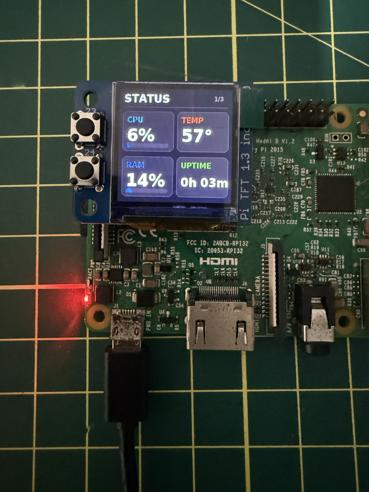
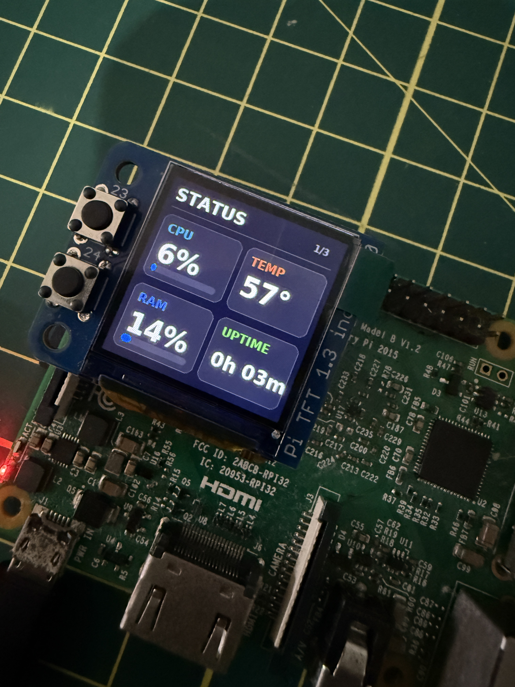
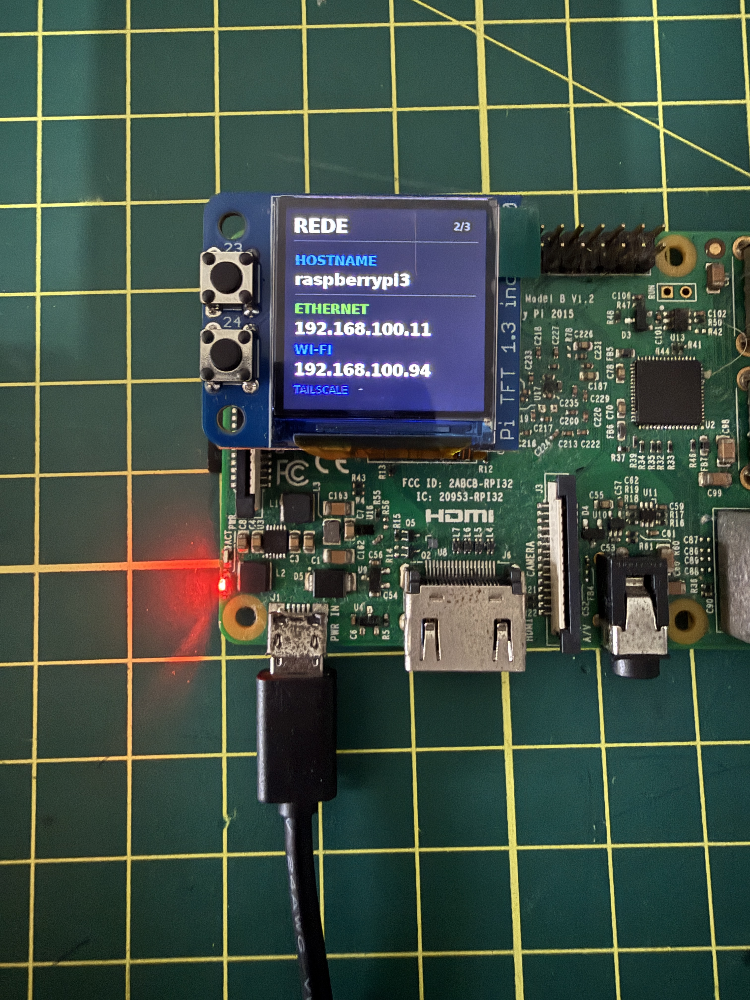
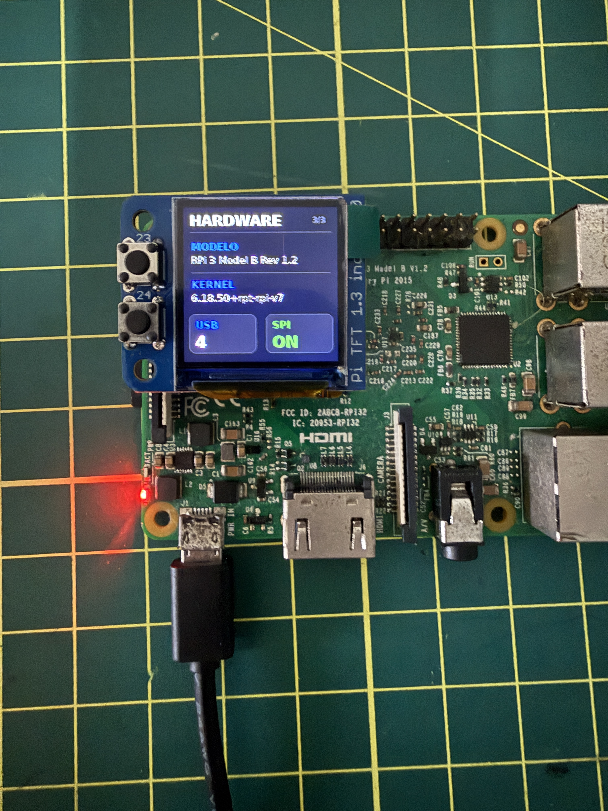
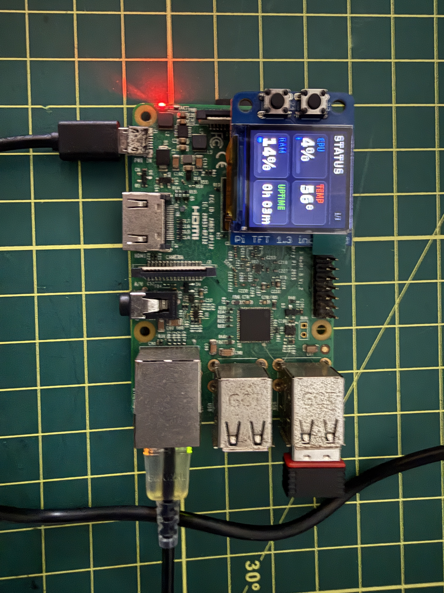

# Raspberry Pi ST7789 Dashboard

Dashboard compacto para Raspberry Pi com display TFT ST7789 1.3" 240×240 via SPI e navegação por dois botões físicos.



O projeto foi desenvolvido e validado em um **Raspberry Pi 3 Model B V1.2**, usando Raspberry Pi OS Lite 32-bit, e exibe informações de sistema em três páginas.

## Visão do produto

O projeto combina um **microdashboard modular, offline-first e controlado por dois botões** com um painel web local. O display continua funcional sem navegador e sem internet; a interface web apenas configura o conteúdo e o comportamento.

Pelo computador ou celular, o usuário pode:

- escolher quais páginas e recursos aparecem no display;
- alterar a ordem das páginas e o intervalo do carrossel;
- configurar limites de alerta e unidade de temperatura;
- visualizar uma prévia fiel de 240×240 gerada pelo mesmo renderizador Pillow usado no ST7789;
- aplicar mudanças sem editar o código-fonte ou reiniciar o serviço.

O MVP físico está validado no Raspberry Pi 3. O Web Control Panel está implementado e coberto por testes automatizados; a validação final dele no hardware real é o gate atual do projeto.

- [Roadmap do produto](ROADMAP.md)
- [Especificação do Web Control Panel](docs/WEB_CONTROL_PANEL.md)

## Recursos

### Web Control Panel

- interface responsiva para desktop e celular;
- primeiro acesso protegido por PIN local;
- ativação e ordenação das páginas;
- carrossel automático e retomada após uso dos botões;
- limites de alerta de temperatura;
- prévia PNG 240×240 com dados atuais;
- seleção imediata da página exibida no hardware;
- configuração JSON validada e gravada de forma atômica.

### 1. STATUS

- uso de CPU
- temperatura do SoC
- uso de RAM
- uptime
- barras de progresso
- alertas visuais de temperatura



### 2. REDE

- hostname
- IPv4 da Ethernet
- IPv4 do Wi-Fi
- IPv4 do Tailscale, quando instalado



### 3. HARDWARE

- modelo do Raspberry Pi
- versão do kernel
- quantidade de dispositivos USB
- estado da interface SPI



## Hardware usado

- Raspberry Pi 3 Model B V1.2
- display TFT ST7789 1.3" 240×240 SPI
- dois botões integrados ao módulo
- cartão microSD com Raspberry Pi OS

Display usado no protótipo:

https://pt.aliexpress.com/item/1005008209370173.html

> O anúncio pode mudar ou deixar de estar disponível. Confirme a pinagem do seu módulo antes de energizar o circuito.

## Pinagem validada

A configuração abaixo corresponde ao módulo usado neste projeto.

| Função | GPIO BCM |
|---|---:|
| SPI MOSI | GPIO10 |
| SPI SCLK | GPIO11 |
| SPI CS0 | GPIO8 |
| TFT DC | GPIO25 |
| TFT RESET | GPIO27 |
| Botão A | GPIO23 |
| Botão B | GPIO24 |

Os botões utilizam `PULL_UP`:

- solto: `ACTIVE`
- pressionado: `INACTIVE`

No dashboard:

- **GPIO23 / botão superior:** página anterior
- **GPIO24 / botão inferior:** próxima página

### Atenção ao GPIO24

Neste módulo o **GPIO24 é um botão**, portanto ele não deve ser usado como `backlight` no construtor do ST7789.

## Software testado

- Raspberry Pi OS Lite 32-bit
- Debian 13 / Trixie
- Python 3
- `st7789` 1.0.1
- Pillow 12.3.0
- spidev 3.8
- NumPy 2.5.3
- gpiod 2.5.0
- gpiodevice 0.1.0
- Flask 3.1+
- Waitress 3.0+

## Instalação

### 1. Atualize o sistema

```bash
sudo apt update
sudo apt install -y python3-venv python3-pip libopenblas0 fonts-dejavu-core usbutils
```

### 2. Habilite SPI

```bash
sudo raspi-config
```

Acesse:

`Interface Options -> SPI -> Enable`

Depois reinicie:

```bash
sudo reboot
```

Confirme:

```bash
ls /dev/spidev*
```

O esperado é encontrar pelo menos:

```text
/dev/spidev0.0
/dev/spidev0.1
```

### 3. Clone o repositório

```bash
git clone https://github.com/abraaobat/raspberrypi-st7789-dashboard.git
cd raspberrypi-st7789-dashboard
```

### 4. Crie o ambiente virtual

```bash
python3 -m venv ~/st7789-env
source ~/st7789-env/bin/activate
python -m pip install --upgrade pip
pip install -r requirements.txt
```

### 5. Teste manualmente

```bash
python bench_display.py
```

O display deve abrir na página `STATUS`. Use os dois botões para navegar pelas três telas.

Em outro terminal, teste o painel web:

```bash
source ~/st7789-env/bin/activate
waitress-serve --host=0.0.0.0 --port=8080 --call web_app:create_app
```

Acesse `http://raspberrypi.local:8080` ou `http://IP-DO-RASPBERRY:8080`. No primeiro acesso, crie o PIN local do painel.

## Inicialização automática com systemd

Copie os dois serviços:

```bash
sudo cp systemd/bench-display*.service /etc/systemd/system/
```

Se seu usuário não for `pi`, ajuste `User`, `WorkingDirectory`, `Environment=ST7789_DASHBOARD_STATE_DIR` e `ExecStart` nos arquivos antes de ativá-los.

Ative os serviços:

```bash
sudo systemctl daemon-reload
sudo systemctl enable --now bench-display.service bench-display-web.service
```

Verifique:

```bash
systemctl status bench-display.service --no-pager
systemctl status bench-display-web.service --no-pager
```

O esperado é:

```text
Active: active (running)
```

Depois reinicie para testar o autostart:

```bash
sudo reboot
```

O painel fica disponível na porta `8080`. Ele foi projetado para uso na LAN ou pela sua tailnet; não exponha essa porta diretamente à internet.

## Configuração local

O projeto não grava configuração nem credenciais dentro do repositório. Por padrão, os arquivos locais ficam em:

```text
~/.config/raspberrypi-st7789-dashboard/
├── config.json
├── auth.json
├── session-secret.bin
├── control.json
└── display-state.json
```

`config.json` contém apenas opções do dashboard. O PIN é armazenado como hash PBKDF2 com salt; o PIN em texto puro não é salvo.

## Próximas evoluções

O próximo ciclo é de validação e endurecimento no Raspberry Pi real:

- instalar os dois serviços e confirmar atualização sem reinicialização;
- validar Ethernet, Wi-Fi USB, Tailscale e textos longos no display;
- executar teste prolongado de botões, carrossel e reboot;
- ampliar a página Hardware com disco e throttling;
- iniciar o SysOps/Homelab Pack somente após esse gate.

## Comandos úteis

Reiniciar o dashboard:

```bash
sudo systemctl restart bench-display.service
```

Reiniciar somente o painel web:

```bash
sudo systemctl restart bench-display-web.service
```

Parar:

```bash
sudo systemctl stop bench-display.service
```

Logs em tempo real:

```bash
journalctl -u bench-display.service -f
journalctl -u bench-display-web.service -f
```

Desabilitar o autostart:

```bash
sudo systemctl disable bench-display.service
sudo systemctl disable bench-display-web.service
```

Executar os testes sem SPI/GPIO:

```bash
python -m unittest discover -s tests -v
```

## Solução de problemas

### Tela não acende ou não atualiza

Confirme se SPI está habilitado:

```bash
ls /dev/spidev0.0
```

E confira o serviço:

```bash
systemctl status bench-display.service --no-pager
```

### `libopenblas.so.0` ausente

Instale:

```bash
sudo apt install -y libopenblas0
```

### Botões não respondem

Este projeto foi validado com:

- GPIO23 = botão A
- GPIO24 = botão B
- entrada com `PULL_UP`
- pressionado = nível baixo / `Value.INACTIVE`

Módulos visualmente semelhantes podem usar pinagens diferentes.

### Painel web não abre

Confira se o serviço está ativo e se a porta está ouvindo:

```bash
systemctl status bench-display-web.service --no-pager
ss -ltn | grep 8080
```

Use o IP mostrado na página `REDE` se o nome `raspberrypi.local` não resolver no seu computador ou celular.

### Tailscale mostra `-`

Isso é normal quando o Tailscale não está instalado, não está conectado ou não possui IPv4 ativo.

## Fotos da montagem



## Estrutura

```text
.
├── bench_display.py
├── web_app.py
├── dashboard/
│   ├── auth.py
│   ├── catalog.py
│   ├── config.py
│   ├── providers.py
│   ├── rendering.py
│   └── runtime.py
├── static/
├── templates/
├── tests/
├── requirements.txt
├── LICENSE
├── README.md
├── ROADMAP.md
├── project-status.json
├── systemd/
│   ├── bench-display.service
│   └── bench-display-web.service
└── docs/
    ├── WEB_CONTROL_PANEL.md
    └── images/
        ├── hero.jpg
        ├── status.jpg
        ├── network.jpg
        ├── hardware.jpg
        └── overview.jpg
```

## Licença

MIT License. Consulte [LICENSE](LICENSE).
